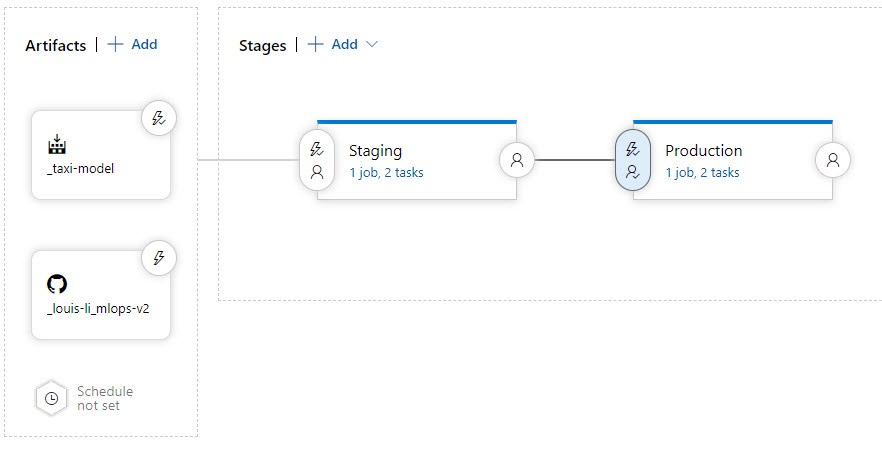
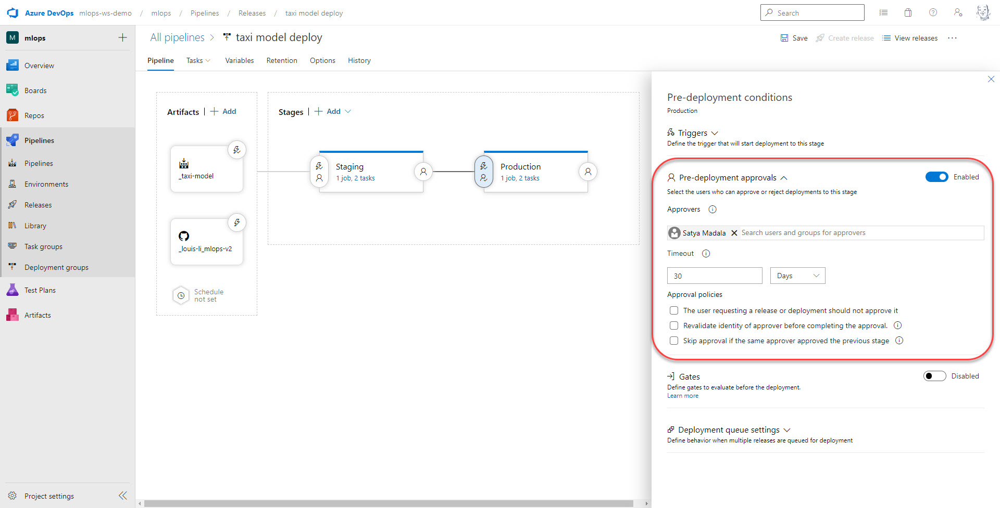

# Azure MLOps (v2) CI/CD Example

This is sample repo to create automated CI/CD process using Azure Pipelines or Github Actions.

## Creating CI/CD with Azure Pipelines

### Create CI using Azure Pipeline Build Pipeline
Following instructions to create CI pipeline for training:
<https://learn.microsoft.com/en-us/azure/machine-learning/how-to-devops-machine-learning>

### Create CD using Azure Pipeline Release Pipeline
1. Install Machine Learning for Azure Pipelines

2. Create a Release pipeline triggered by Azure Machine Learning Model Registry 
    2.1 Add following to your release pipeline: 
    - Azure Machine Learning Registry  
    - Inference Repo to Artifacts  
    - Add stages  
    
    2.2 Add Azure CLI task for preparing environment  
  
    2.3 Add Azure CLI task for model deployment
      
    2.4 Enable trigger - Continuous Deployment
      
    2.5 Predeployment Approal 
      

## Createing CD + CD with Github Actions

<https://learn.microsoft.com/en-us/azure/machine-learning/how-to-github-actions-machine-learning?tabs=userlevel>

for bootstrapping your own MLOps projects.

## Steps to Deploy

Clone this repository to your own GitHub organization and follow the steps below to deploy the demo.

1. [Create an Azure Service Principal and configure GitHub actions secrets.](#configure-github-actions-secrets)
2. [Configure dev and/or prod environments and create a dev branch.](#configure-azure-ml-environment-parameters)
3. [Use a GitHub workflow to create Azure ML infrastructure for dev and/or prod environments.](#deploy-azure-machine-learning-infrastructure)
4. [Use a GitHub workflow to create and run a pytorch vision model training pipeline in Azure ML.](#train-a-pytorch-classifier-in-azure-machine-learning)
5. [Use a GitHub workflow to deploy the vision model as a real-time endpoint in Azure ML.](#deploy-the-registered-model-to-an-online-endpoint)

---

## Configure GitHub Actions Secrets

   This step creates a service principal and GitHub secrets to allow the GitHub action workflows to create and interact with Azure Machine Learning Workspace resources.
   
   From the command line, execute the following Azure CLI command with your choice of a service principal name:
   
   > `# az ad sp create-for-rbac --name <service_principal_name> --role contributor --scopes /subscriptions/<subscription_id> --sdk-auth`
   
   You will get output similar to below:

   >`{`  
   > `"clientId": "<service principal client id>",`  
   > `"clientSecret": "<service principal client secret>",`  
   > `"subscriptionId": "<Azure subscription id>",`  
   > `"tenantId": "<Azure tenant id>",`  
   > `"activeDirectoryEndpointUrl": "https://login.microsoftonline.com",`  
   > `"resourceManagerEndpointUrl": "https://management.azure.com/",`  
   > `"activeDirectoryGraphResourceId": "https://graph.windows.net/",`  
   > `"sqlManagementEndpointUrl": "https://management.core.windows.net:8443/",`  
   > `"galleryEndpointUrl": "https://gallery.azure.com/",`  
   > `"managementEndpointUrl": "https://management.core.windows.net/"`  
   > `}`
   
   Copy all of this output, braces included. From your GitHub project, select **Settings**:

    

   Then select **Secrets**, then **Actions**:

 

    

Select **New repository secret**. Name this secret **AZURE_CREDENTIALS** and paste the service principal output as the content of the secret.  Select **Add secret**.

> **Note:**  
> As this infrastructure is deployed using terraform, add the following additional GitHub secrets using the corresponding values from the service principal output as the content of the secret:  
> 
> **ARM_CLIENT_ID**  
> **ARM_CLIENT_SECRET**  
> **ARM_SUBSCRIPTION_ID**  
> **ARM_TENANT_ID**  

The GitHub configuration is complete.

---

 ## Deploy Azure Machine Learning Infrastructure

   In your GitHub project repository, select **Actions**

   

   This will display the pre-defined GitHub workflows associated with your project. For a classical machine learning project, the available workflows will look similar to this:

    

   Depending on the the use case, available workflows may vary. Select the workflow to 'deploy-infra'. In this scenario, the workflow to select would be **tf-gha-deploy-infra.yml**. This would deploy the Azure ML infrastructure using GitHub Actions and Terraform.

   

   On the right side of the page, select **Run workflow** and select the branch to run the workflow on. This will deploy Dev Infrastructure if run on a dev branch or Prod infrastructure if running on main. Monitor the pipeline for successful completion.

   

   When the pipeline has complete successfully, you can find your Azure ML Workspace and associated resources by logging in to the Azure Portal.

   Next, a sample model training pipeline will be deployed into the new Azure Machine Learning environment.

---

## Train a Pytorch Classifier in Azure Machine Learning

The solution accelerator includes code and data for a sample machine learning pipeline which trains a dog breed classifier on the [Stanford Dogs Dataset](http://vision.stanford.edu/aditya86/ImageNetDogs/main.html). 

The https://github.com/sdonohoo/mlops-cv-demo/blob/main/.github/workflows/deploy-model-training-pipeline.ymlGitHub workflow creates both cpu and gpu-based compute clusters in the Azure ML workspace. The cpu cluster is used for the data registration job that downloads and registers the training image dataset in Azure ML. The gpu cluster is used by an Azure ML pipeline with a single component that trains and registers a pytorch classifier model on this dataset.

To deploy the model training pipeline in the previously created Azure ML workspace, select **Actions** in your GitHub project repository. 

   

Then select the `deploy-cv-model-training-pipeline`.

    

As before, select  **Run workflow** on the right and select the branch to run from. This will run the workflow, create compute clusters, register the dataset, and deploy the training pipeline in Azure ML.

Once the run-model-training-pipeline job begins running, you can follow the execution of this job in the Azure ML workspace. 

    

When the Azure ML pipeline completes, the trained model should be registered in the workspace.

    

Next, the registered model will be deployed to a real-time endpoint for classifying new images.

---

## Deploy the Registered Model to an Online Endpoint

This step uses a GitHub workflow to deploy the registered model to an Azure ML Managed Online Endpoint for predicting the class of new images.

This workflow will register the interference environment with prerequisite python packages, create an Azure ML endpoint, create a deployment of the registered model to that endpoint, then allocate traffic to the endpoint.

To run the workflow to deploy the registered model as a managed online endpoint, select **Actions** in your GitHub project repository.

   

Then select the `deploy-online-endpoint-pipeline`.

    

Run the workflow.

As the create-endpoint job begins, you can monitor the ednpoint creation, deployment creation, and traffic allocation in the Azure ML workspace.

    

---

## Next Steps

* Explore the construction of the GitHub workflows to deploy infastructure and deploy pipelines and register artifacts in Azure ML.
* Explore the python code in `data-science/` and Azure ML pipeline definitions in `mlops/azureml/` to understand how to adapt your own computer vision code to this pattern.
* Configure the GitHub repository and workflows to fit your MLOps workflows and policies utilizing prod/dev branches, branch protection, and pull requests.

